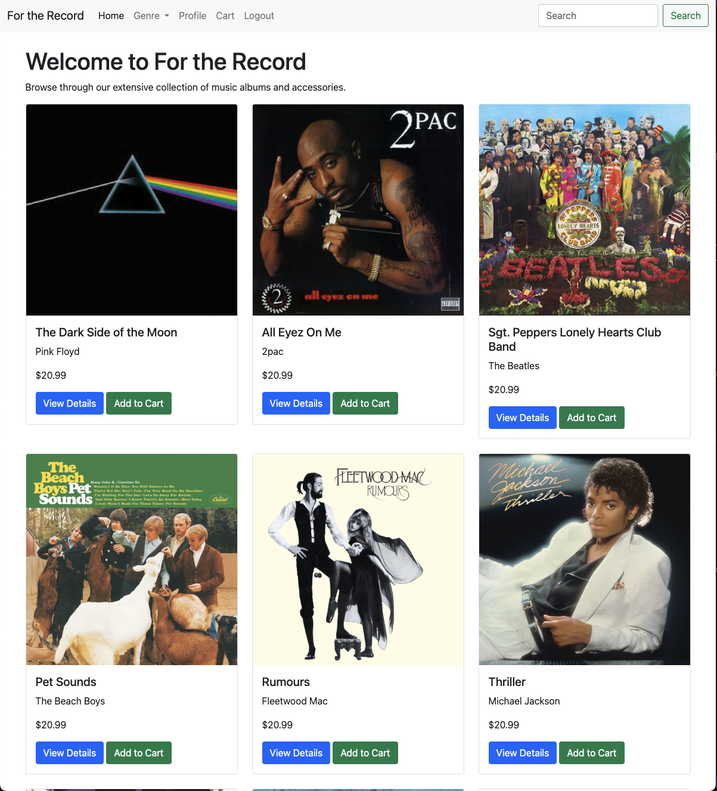

# For The Record - Music Store

<!--  -->


## Developer: Darrel Nitereka

---

## Introduction

For The Record is a full-stack music store web application that I developed to provide users with a seamless browsing and shopping experience for music albums. This project showcases my skills in backend and frontend development, database management, and user authentication. It includes features such as album browsing, shopping cart functionality, search capabilities, and an admin panel for inventory management.

Originally conceptualized as a collaborative project, I took full ownership of the development process, building the backend with Node.js and Express, structuring the database with SQLite, and rendering the UI using EJS and Bootstrap. This project serves as a demonstration of my ability to design, develop, and deploy a fully functional web application.

### **Homepage Preview**



## Tech Stack

- **Backend:** Node.js, Express.js
- **Database:** SQLite
- **Frontend:** EJS (Embedded JavaScript Templates)
- **Styling:** Bootstrap
- **Environment Management:** dotenv (if applicable)

---

## Features

- **Browse Albums & Artists**: View a catalog of music albums and artists.
- **Shopping Cart**: Add, remove, and checkout items.
- **Search Functionality**: Search for albums and artists in the store.
- **User Authentication**: Create an account, log in, and manage purchases.
- **Admin Panel**: Manage store inventory (add/edit/remove products).

## Installation & Setup

### Prerequisites

- Install **Node.js** & **npm**
- Clone this repository:
  ```bash
  git clone https://github.com/yourusername/for-the-record.git
  cd for-the-record
  ```
- Install dependencies:
  ```bash
  npm install
  ```
- Set up SQLite database:
  ```bash
  node database.js
  ```
- Run the server:
  ```bash
  npm start
  ```
  The app should now be running on **[http://localhost:3000](http://localhost:3000)**.

## Code Overview

### Models

Database models handle data retrieval and persistence using SQLite.

```javascript
const db = require('../database');

class Product {
  static async findAll() {
    return db.all('SELECT * FROM products');
  }
}
```

### Controllers

Controllers handle data retrieval logic.

```javascript
const Album = require('../models/Album');

exports.getAlbums = async (req, res) => {
  try {
    const albums = await Album.findAll();
    res.render('albums', { albums });
  } catch (error) {
    res.status(500).send('Error retrieving albums');
  }
};
```

### Views

EJS templates dynamically render pages with SQLite data.

```html
<nav>
  <ul>
    <li><a href="/">Home</a></li>
    <li><a href="/shop">Shop</a></li>
  </ul>
</nav>
```

---

## Usage

### User Flows

- **Add Item to Cart**

  1. Navigate to the shop page.
  2. Click "Add to Cart" on a product.
  3. Item appears in the cart.

- **Checkout Process**

  1. Click "Checkout" in the cart.
  2. Enter required details (name, email, payment info).
  3. Confirm purchase.

- **Admin Panel Access**

  1. Log in as an admin.
  2. Manage product inventory (add, edit, delete products).

---

## Future Enhancements

- Integrate **payment gateway** for actual transactions.
- Improve search functionality with **filters & sorting**.
- Add API integrations for **music recommendations**.

## License

MIT License

## Contact

For questions, feel free to reach out or connect with me:

- [LinkedIn Profile](https://www.linkedin.com/in/darrel-nitereka-414452233//)
- [GitHub Profile](https://github.com/DarrelN15)


